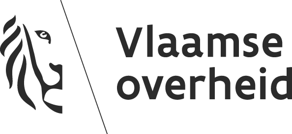

<p align="center">
  
</p>


# LYNX
#### Project for the Belgian Agency of Domestic Affairs.
<br/>

# A brief summary of Lynx

<p align="center"></p>

<br/>
LYNX is a linked open data web-based application developed for Agentschap Binnenlands Bestuur (ABB) in collaboration with Open Summer of Code. The web app simplifies the information hierarchy between citizens and their local governments in Flanders and Brussels with the final goal to improve communication transparency in tax information. As the amount of tax data becomes more abundant without a clear and organized structure, citizens find it too difficult to stay up to date with the tax decisions from their local municipality and many are discouraged to do their own research. With LYNX, citizens will be able to consult the latest tax decisions in their local municipalities, as well as compare tax-related information between other municipalities. Thanks to linked open data, this government service will increase citizen engagement in the decision-making process and further improve data-sharing culture between residents and their municipalities.
<br/><br/>  

# Setting up
For setting up a local development environment, you first need to install a pair of dependencies. 
  
## Dependencies
  
  For the backend you will need:
  - Docker: [Click here to install](https://docs.docker.com/get-docker/)

  And for the frontend:
  - NodeJS: [Click here to install](https://nodejs.org/en/download/)
  
<br/>
  
# Running and Deploying
  
  ## Backend
  For running the backend you first need to change to the backend directory:  
  ```
  cd backend
  ```  
  
  then instantiate the docker environment
  ```
  docker compose-up
  ```
  
  After these instructions you will find the API on localhost:8890
  
  ## Frontend
  For running the frontend you need to change to the frontend directory:
  ```
  cd frontend
  ```  
  
  Then install the node dependencies.
  ```
  npm install
  ```  
  
  After that you can start the frontend application
  ```
  npm start
  ```  
  
  You will find the application on localhost:5000
<br/><br/>

# Credits

<footer>
	<p align="center"></p>br/>
	This project was made possible thanks to the Flemish Government...  
	<p align="center"></p><br/>
	As well as Open Summer of Code!  
</footer>